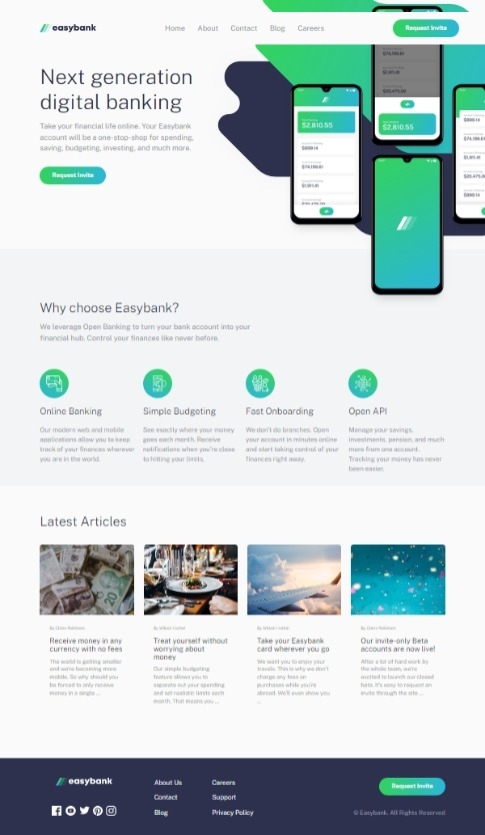

# Frontend Mentor - Easybank landing page solution
This is a solution to the [Easybank landing page challenge on Frontend Mentor](https://www.frontendmentor.io/challenges/easybank-landing-page-WaUhkoDN). Frontend Mentor challenges help you improve your coding skills by building realistic projects. 

### The challenge
Users should be able to:
- View the optimal layout for the site depending on their device's screen size
- See hover states for all interactive elements on the page

### Screenshot

### Links
- Solution URL: [Add solution URL here](https://your-solution-url.com)
- Live Site URL: [https://nicholaschristopherblake.github.io/Easybank_Landing_Page/](https://nicholaschristopherblake.github.io/Easybank_Landing_Page/)

### Built with
- Semantic HTML5 markup
- CSS custom properties
- Flexbox
- CSS Grid
- Mobile-first workflow
- Sass

- Website - [Nicholas C Blake](https://github.com/NicholasChristopherBlake)
