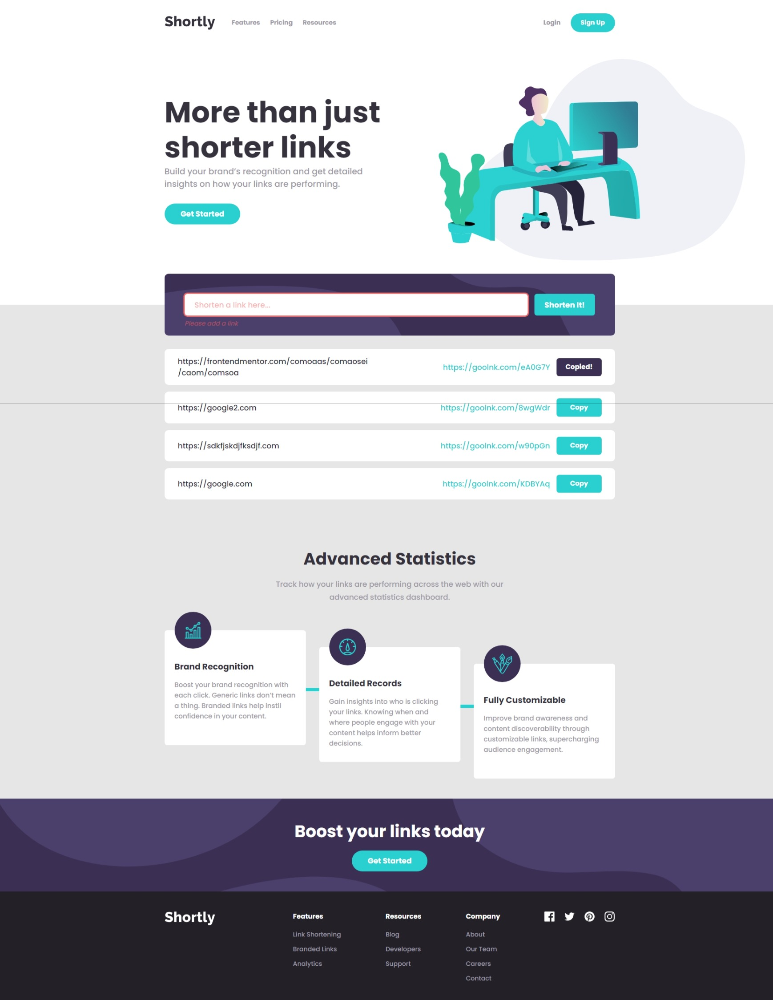

# Frontend Mentor - Shortly URL shortening API Challenge solution

This is a solution to the [Shortly URL shortening API Challenge challenge on Frontend Mentor](https://www.frontendmentor.io/challenges/url-shortening-api-landing-page-2ce3ob-G). Frontend Mentor challenges help you improve your coding skills by building realistic projects.

## Table of contents

- [Overview](#overview)
  - [The challenge](#the-challenge)
  - [Screenshot](#screenshot)
- [Author](#author)

## Overview

### The challenge

Users should be able to:

- View the optimal layout for the site depending on their device's screen size
- Shorten any valid URL
- See a list of their shortened links, even after refreshing the browser
- Copy the shortened link to their clipboard in a single click
- Receive an error message when the `form` is submitted if:
  - The `input` field is empty

### Links

- Solution URL: [Add solution URL here](https://your-solution-url.com)
- Live Site URL: [https://nicholaschristopherblake.github.io/9.-URL-Shortening-API-Intermediate/](https://nicholaschristopherblake.github.io/9.-URL-Shortening-API-Intermediate/)

## Author

- Website - [Nicholas C. Blake](https://github.com/NicholasChristopherBlake)
- Frontend Mentor - [@NicholasChristopherBlake](https://www.frontendmentor.io/profile/NicholasChristopherBlake)

### Screenshot

